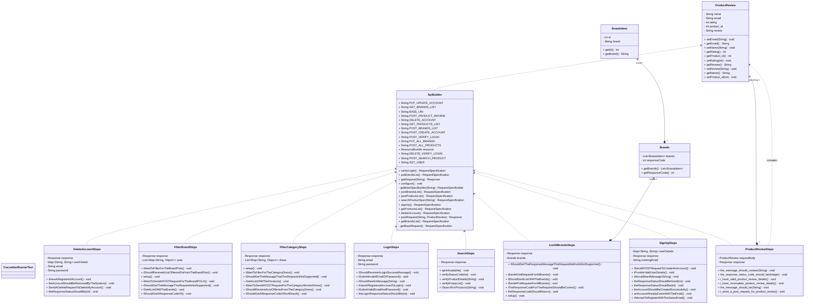

 

```mermaid
classDiagram  
direction BT  
class ApiBuilder {  
  + String PUT_UPDATE_ACCOUNT  
  + String GET_BRANDS_LIST  
  + String BASE_URI  
  + String POST_PRODUCT_REVIEW  
  + String DELETE_ACCOUNT  
  + String GET_PRODUCTS_LIST  
  + String POST_BRANDS_LIST  
  + String POST_CREATE_ACCOUNT  
  + String POST_VERIFY_LOGIN  
  + String PUT_ALL_BRANDS  
  + String POST_ALL_PRODUCTS  
  + ResourceBundle resource  
  + String DELETE_VERIFY_LOGIN  
  + String POST_SEARCH_PRODUCT  
  + String GET_USER  
  + verifyLogin() RequestSpecification  
  + putBrandsList() RequestSpecification  
  + getRequest(String) Response  
  + configure() void  
  - getBaseSpecBuilder(String) RequestSpecBuilder  
  + postBrandsList() RequestSpecification  
  + postProductsList() RequestSpecification  
  + searchProductSpec(String) RequestSpecification  
  + signUp() RequestSpecification  
  + getProductsList() RequestSpecification  
  + deleteAccount() RequestSpecification  
  + postRequest(String, ProductReview) Response  
  + getBrandsList() RequestSpecification  
  - getBaseRequest() RequestSpecification  
}  
class Brands {  
  - List~BrandsItem~ brands  
  - int responseCode  
  + getBrands() List~BrandsItem~  
  + getResponseCode() int  
}  
class BrandsItem {  
  - int id  
  - String brand  
  + getId() int  
  + getBrand() String  
}  
class CucumberRunnerTest  
class DeleteAccountSteps {  
  - Response response  
  - Map~String, String~ userDetails  
  - String email  
  - String password  
  + iHaveARegisteredAccount() void  
  + theAccountShouldBeRemovedByTheSystem() void  
  + iSendADeleteRequestToDeleteMyAccount() void  
  + theResponseStatusShouldBe(int) void  
}  
class FilterBrandSteps {  
  - Response response  
  - List~Map~String, Object~~ polo  
  + iWantToFilterForTheBrandPolo() void  
  + iShouldReceiveAListOfItemsIDsFromTheBrandPolo() void  
  + setup() void  
  + iWantToSendAPOSTRequestForTheBrandPOLO() void  
  + iShouldGetTheMessageThisRequestIsNotSupported() void  
  + iGetAListOfAllTheBrands() void  
  + iShouldGetAResponseCodeOf() void  
}  
class FilterCategorySteps {  
  - Response response  
  - List~Map~String, Object~~ dress  
  + setup() void  
  + iWantToFilterForTheCategoryDress() void  
  + iShouldGetTheMessageThatThisRequestIsNotSupported() void  
  + iGetAListOfAllTheProducts() void  
  + iWantToSendAPOSTRequestForTheCategoryWomenDress() void  
  + iShouldReceiveAListOfItemsFromTheCategoryDress() void  
  + iShouldGetAResponseCodeOfAsAResult() void  
}  
class ListAllBrandsSteps {  
  - Response response  
  - Brands brands  
  + iShouldGetTheResponseMessageThisRequestMethodIsNotSupported() void  
  + iSendAGetRequestForAllBrands() void  
  + iShouldGetAListOfAllTheBrands() void  
  + iSendAPutRequestForAllBrands() void  
  + iTheResponseCodeForTheRequestShouldBeCorrect() void  
  + theResponseCodeShouldReturn() void  
  + setup() void  
}  
class LoginSteps {  
  - Response response  
  - String email  
  - String password  
  + iShouldReceiveALoginSuccessMessage() void  
  + iSubmitInvalidEmailOrPassword() void  
  + iShouldSeeAnMessage(String) void  
  + iHaveARegisteredAccountToLogin() void  
  + iSubmitValidEmailAndPassword() void  
  + theLoginResponseStatusShouldBe(int) void  
}  
class ProductReview {  
  - String name  
  - String email  
  - int rating  
  - int product_id  
  - String review  
  + setEmail(String) void  
  + getEmail() String  
  + setName(String) void  
  + getRating() int  
  + getProduct_id() int  
  + setRating(int) void  
  + getReview() String  
  + setReview(String) void  
  + getName() String  
  + setProduct_id(int) void  
}  
class ProductReviewSteps {  
  - ProductReview requestBody  
  - Response response  
  + the_message_should_contain(String) void  
  + the_response_status_code_should_be(Integer) void  
  + i_have_valid_product_review_details() void  
  + i_have_incomplete_product_review_details() void  
  + the_message_should_be(String) void  
  + i_send_a_post_request_for_product_review() void  
}  
class SearchSteps {  
  - Response response  
  + apiIsAvailable() void  
  + verifyStatusCode(int) void  
  + verifyProductDetails(String) void  
  + verifyEmptyList() void  
  + iSearchForProducts(String) void  
}  
class SignUpSteps {  
  - Map~String, String~ userDetails  
  - Response response  
  - String existingEmail  
  + iSendAPOSTRequestToCreateAnAccount() void  
  + iProvideValidUserDetails() void  
  + iShouldSeeAMessage(String) void  
  + theResponseStatusShouldBeGood(int) void  
  + theResponseStatusShouldBe(int) void  
  + theAccountShouldBeCreatedSuccessfully() void  
  + anAccountAlreadyExistsWithTheEmail() void  
  + iAttemptToRegisterWithTheSameEmail() void  
}

ApiBuilder  ..>  ProductReview   
Brands "1" *--> "brands *" BrandsItem   
DeleteAccountSteps  ..>  ApiBuilder   
FilterBrandSteps  ..>  ApiBuilder   
FilterCategorySteps  ..>  ApiBuilder   
ListAllBrandsSteps  ..>  ApiBuilder   
ListAllBrandsSteps "1" *--> "brands 1" Brands   
LoginSteps  ..>  ApiBuilder   
ProductReviewSteps  ..>  ApiBuilder   
ProductReviewSteps "1" *--> "requestBody 1" ProductReview   
ProductReviewSteps  ..>  ProductReview : «create»  
SearchSteps  ..>  ApiBuilder   
SignUpSteps  ..>  ApiBuilder

```
