PROJECT OVERVIEW

This project is a robust, BDD-driven test automation framework designed to validate the Automation Exercise REST API. 
Developed by a Scrum team of 8, the framework ensures the reliability of core business logic such as product retrieval, brand management, and user authentication.

🧱 FRAMEWORK ARCHITECHTURE
The framework is built around:

Service Object Model (SOM) for clean separation of API logic

RestAssured for HTTP request/response handling

Cucumber BDD (optional) for human‑readable test scenarios

JUnit 5 for test execution

Mockito for unit testing helper utilities

Maven for dependency management and build automation

TECH STACK
Language: Java 17

API Client: RestAssured

Test Runner: JUnit 5 / Cucumber

Mocking: Mockito (for Unit Testing utility logic)

Build Tool: Maven

Prerequisites
JDK 17 or higher

Maven 3.8.1+

IntelliJ IDEA (recommended)

📌 FEATURES

Automated tests for 3+ API endpoints

Happy & sad path coverage

Unit tests for helper logic using Mockito

Optional Cucumber BDD support

Clean, modular framework structure

GitHub repo with feature branches & regular commits

END POINTS COVERED

At least three endpoints are fully validated, including:

1. GET /productsList
   
Validate status code

Validate response schema

Validate product fields (id, name, price, brand, category)

2. POST /verifyLogin
   
Happy path: valid email + password

Sad path: invalid credentials

Validate error messages

3. POST /createAccount

Validate required fields

Validate error handling

Validate success response

✔️ TEST COVERAGE

Happy Path Tests

1.Valid requests return correct status codes

2.Response body contains expected fields

3.Schema validation

4.Data integrity checks

Sad Path Tests

1.Missing fields

2.Invalid data types

3.Incorrect credentials

4.Unsupported methods

5.Boundary value tests

▶️ RUNNING THE FRAMEWORK

Install dependencies : mvn clean install

Run all tests : mvn test

Run Cucumber tests : mvn test -Dcucumber.filter.tags="@smoke"

Run unit tests only : mvn -Dtest=*UnitTest test

🧩 EXTENDING THE FRAMEWORK
To add a new endpoint:

1.Create a new Client class under clients/

2.Add POJOs under pojos/

3.Add tests under tests/

4.(Optional) Add feature files under features/

5.Add unit tests under unit/

6.Create a feature branch and open a PR into dev

This ensures consistency and maintainability for future teams.

📌 GIT WORKFLOW

This project follows GitHub Flow:

main → stable, production-ready

dev → integration branch

Feature branches:

Gayathri-ProductReview

Kevin--Individual-Search

Zakir-Login

Rafid-SignUp-Delete

Anthony-Filtering

Mohammed-SearchAll

Josef-Subscription

Leonidas-ContactUs

📌 SCRUM & PROJECT BOARD

A GitHub projectboard was used with 7 columns:

Bugs

Product Backlog

Sprint Backlog

In Progress

In Review

Done

Notes (Goal + DoD)

PROJECT GOAL:

Deliver a complete, maintainable API testing framework for AutomationExercise API within one sprint.

Definition of Done

Code committed & reviewed

Tests automated & passing

Unit tests included

README updated

Feature merged into dev

No critical bugs

📌 CLASS DIAGRAM

```mermaid 

classDiagram  
direction BT  
class ApiBuilder {  
  + String PUT_UPDATE_ACCOUNT  
  + String GET_BRANDS_LIST  
  + String BASE_URI  
  + String POST_PRODUCT_REVIEW  
  + String DELETE_ACCOUNT  
  + String GET_PRODUCTS_LIST  
  + String POST_BRANDS_LIST  
  + String POST_CREATE_ACCOUNT  
  + String POST_VERIFY_LOGIN  
  + String PUT_ALL_BRANDS  
  + String POST_ALL_PRODUCTS  
  + ResourceBundle resource  
  + String DELETE_VERIFY_LOGIN  
  + String POST_SEARCH_PRODUCT  
  + String GET_USER  
  + verifyLogin() RequestSpecification  
  + putBrandsList() RequestSpecification  
  + getRequest(String) Response  
  + configure() void  
  - getBaseSpecBuilder(String) RequestSpecBuilder  
  + postBrandsList() RequestSpecification  
  + postProductsList() RequestSpecification  
  + searchProductSpec(String) RequestSpecification  
  + signUp() RequestSpecification  
  + getProductsList() RequestSpecification  
  + deleteAccount() RequestSpecification  
  + postRequest(String, ProductReview) Response  
  + getBrandsList() RequestSpecification  
  - getBaseRequest() RequestSpecification  
}  
class Brands {  
  - List~BrandsItem~ brands  
  - int responseCode  
  + getBrands() List~BrandsItem~  
  + getResponseCode() int  
}  
class BrandsItem {  
  - int id  
  - String brand  
  + getId() int  
  + getBrand() String  
}  
class CucumberRunnerTest  
class DeleteAccountSteps {  
  - Response response  
  - Map~String, String~ userDetails  
  - String email  
  - String password  
  + iHaveARegisteredAccount() void  
  + theAccountShouldBeRemovedByTheSystem() void  
  + iSendADeleteRequestToDeleteMyAccount() void  
  + theResponseStatusShouldBe(int) void  
}  
class FilterBrandSteps {  
  - Response response  
  - List~Map~String, Object~~ polo  
  + iWantToFilterForTheBrandPolo() void  
  + iShouldReceiveAListOfItemsIDsFromTheBrandPolo() void  
  + setup() void  
  + iWantToSendAPOSTRequestForTheBrandPOLO() void  
  + iShouldGetTheMessageThisRequestIsNotSupported() void  
  + iGetAListOfAllTheBrands() void  
  + iShouldGetAResponseCodeOf() void  
}  
class FilterCategorySteps {  
  - Response response  
  - List~Map~String, Object~~ dress  
  + setup() void  
  + iWantToFilterForTheCategoryDress() void  
  + iShouldGetTheMessageThatThisRequestIsNotSupported() void  
  + iGetAListOfAllTheProducts() void  
  + iWantToSendAPOSTRequestForTheCategoryWomenDress() void  
  + iShouldReceiveAListOfItemsFromTheCategoryDress() void  
  + iShouldGetAResponseCodeOfAsAResult() void  
}  
class ListAllBrandsSteps {  
  - Response response  
  - Brands brands  
  + iShouldGetTheResponseMessageThisRequestMethodIsNotSupported() void  
  + iSendAGetRequestForAllBrands() void  
  + iShouldGetAListOfAllTheBrands() void  
  + iSendAPutRequestForAllBrands() void  
  + iTheResponseCodeForTheRequestShouldBeCorrect() void  
  + theResponseCodeShouldReturn() void  
  + setup() void  
}  
class LoginSteps {  
  - Response response  
  - String email  
  - String password  
  + iShouldReceiveALoginSuccessMessage() void  
  + iSubmitInvalidEmailOrPassword() void  
  + iShouldSeeAnMessage(String) void  
  + iHaveARegisteredAccountToLogin() void  
  + iSubmitValidEmailAndPassword() void  
  + theLoginResponseStatusShouldBe(int) void  
}  
class ProductReview {  
  - String name  
  - String email  
  - int rating  
  - int product_id  
  - String review  
  + setEmail(String) void  
  + getEmail() String  
  + setName(String) void  
  + getRating() int  
  + getProduct_id() int  
  + setRating(int) void  
  + getReview() String  
  + setReview(String) void  
  + getName() String  
  + setProduct_id(int) void  
}  
class ProductReviewSteps {  
  - ProductReview requestBody  
  - Response response  
  + the_message_should_contain(String) void  
  + the_response_status_code_should_be(Integer) void  
  + i_have_valid_product_review_details() void  
  + i_have_incomplete_product_review_details() void  
  + the_message_should_be(String) void  
  + i_send_a_post_request_for_product_review() void  
}  
class SearchSteps {  
  - Response response  
  + apiIsAvailable() void  
  + verifyStatusCode(int) void  
  + verifyProductDetails(String) void  
  + verifyEmptyList() void  
  + iSearchForProducts(String) void  
}  
class SignUpSteps {  
  - Map~String, String~ userDetails  
  - Response response  
  - String existingEmail  
  + iSendAPOSTRequestToCreateAnAccount() void  
  + iProvideValidUserDetails() void  
  + iShouldSeeAMessage(String) void  
  + theResponseStatusShouldBeGood(int) void  
  + theResponseStatusShouldBe(int) void  
  + theAccountShouldBeCreatedSuccessfully() void  
  + anAccountAlreadyExistsWithTheEmail() void  
  + iAttemptToRegisterWithTheSameEmail() void  
}

ApiBuilder  ..>  ProductReview   
Brands "1" *--> "brands *" BrandsItem   
DeleteAccountSteps  ..>  ApiBuilder   
FilterBrandSteps  ..>  ApiBuilder   
FilterCategorySteps  ..>  ApiBuilder   
ListAllBrandsSteps  ..>  ApiBuilder   
ListAllBrandsSteps "1" *--> "brands 1" Brands   
LoginSteps  ..>  ApiBuilder   
ProductReviewSteps  ..>  ApiBuilder   
ProductReviewSteps "1" *--> "requestBody 1" ProductReview   
ProductReviewSteps  ..>  ProductReview : «create»  
SearchSteps  ..>  ApiBuilder   
SignUpSteps  ..>  ApiBuilder

```

👥 CONTRIBUTORS
Team of 8 Automation Test Engineers
Working collaboratively using Scrum methodology.

 

